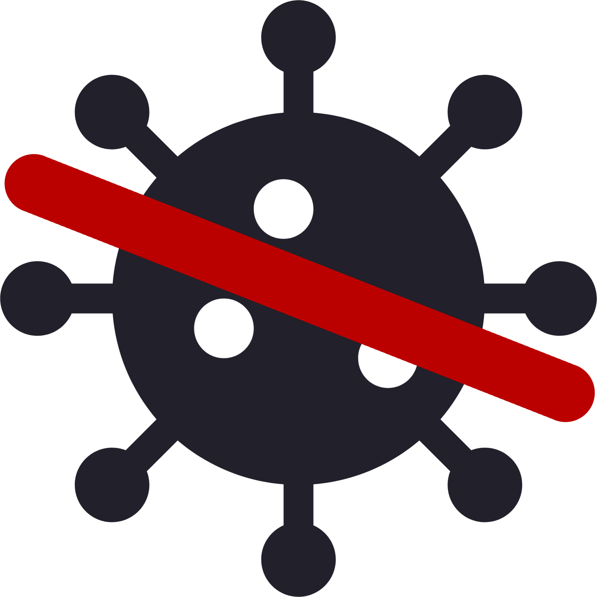

# AVScanner

A ClamAV frontend to scan for Viruses

### Requirements

- [ClamAV](https://www.clamav.net/) installed locally on the machine (and accessible on the $PATH) 
  (on Mac, install via [brew](https://formulae.brew.sh/formula/clamav#default))
- [CustomTkinter](https://customtkinter.tomschimansky.com/documentation/widgets) (by Tom Schimansky)
- [Pillow](https://pillow.readthedocs.io/en/stable/reference/Image.html)

 

Code Repo: https://github.com/wrogner/AVScanner

### Credits

&copy; 2023 by war

### Open Issues / Roadmap

TODO: 
(Note: I use [Todo Tree](https://marketplace.visualstudio.com/items?itemName=Gruntfuggly.todo-tree) in VSCode to color-codes stati. It's optional and not transfered to the markdown file.)

[x] Add remote repo 
[x] Setup GUI editing 
&nbsp;&nbsp;&nbsp;&nbsp;&nbsp;&nbsp;PyGubu not really usable (outdated code) 
[x] Create application framework 
[x] Application deployment (packaging, executable) 
&nbsp;&nbsp;&nbsp;&nbsp;&nbsp;&nbsp;[x] create PyPI account [https://packaging.python.org/en/latest/tutorials/packaging-projects/#uploading-the-distribution-archives] 
&nbsp;&nbsp;&nbsp;&nbsp;&nbsp;&nbsp;[x] install build tools (build, setuptools) [https://setuptools.pypa.io/en/latest/index.html] 
&nbsp;&nbsp;&nbsp;&nbsp;&nbsp;&nbsp;[x] create buildable package [https://packaging.python.org/en/latest/tutorials/packaging-projects/#generating-distribution-archives] 
&nbsp;&nbsp;&nbsp;&nbsp;&nbsp;&nbsp;[x] upload using twine [https://packaging.python.org/en/latest/tutorials/packaging-projects/#uploading-the-distribution-archives] 
[ ] Update logic 
[ ] Simple Scanning (single file / directory) 
[ ] update database (call freshclam) 

